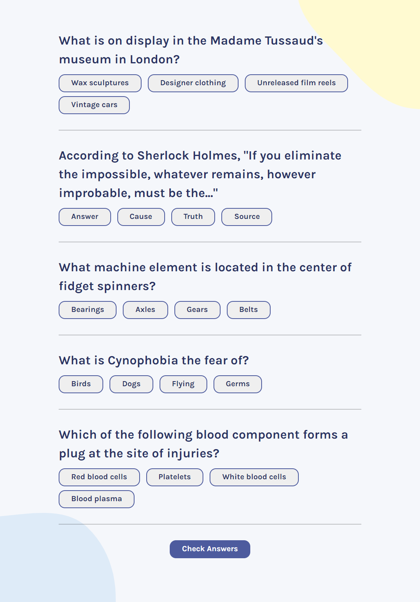

## Table of contents

- [Overview](#overview)
  - [Links](#links)
  - [Built with](#Built-with)

## Overview

this is a react app that fetches data from [Open Triva API](https://opentdb.com/api_config.php) and displays the questions and multiple answers
and after submitting your answers you get the score and right and wrong answers in green and red accordingly.

### Links

- [Live Site URL](https://yacinekahlerras.github.io/Quiz-React-App/)

### Built with

- [React](https://reactjs.org/) - JS library
- [Sass](https://sass-lang.com/) - Css framework
- Semantic HTML5 markup
- CSS custom properties
- Flexbox
- CSS Grid
- Mobile-first workflow
